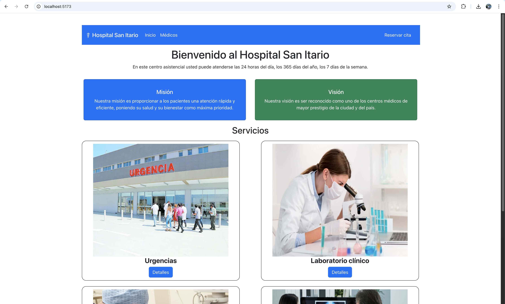

# Sitio Web Hospital San Itario (v3)
Repositorio que contiene la capa de front-end del sitio web del Hospital San Itario. Esta versión se desarrolló usando el framework React.

## Alumno
Felipe Cárdenas Molina

## Despliegue local
Para desplegar el sitio en su ambiente local, se debe realizar lo siguiente:

1. Clonar el repositorio del sitio web:
```
git clone git@github.com:pipecm/adalid-frontend-hospital-2025.git
```

2. Acceder a la carpeta recientemente descargada:
```
cd adalid-frontend-hospital-2025
```

3. Ejecutar el comando para instalar las dependencias de Bootstrap:
```
npm install
```

4. Ejecutar el comando para levantar localmente el servidor que provee de un entorno backend con `json-server`:
```
npm run server
```
Una vez levantado el servidor, éste se encontrará disponible en `http://localhost:3001`.

5. Ejecutar el comando para levantar localmente el sitio web:
```
npm run dev
```

6. Abrir un browser y acceder al sitio del hospital por medio de la siguiente URL:
```
http://localhost:5173
```

Si todo lo anterior se realizó correctamente, se debería visualizar el sitio web como en la imagen siguiente:



## Ejercicio técnico Nº2 - Módulo 4
### Manejo del DOM virtual en ReactJS
Para la renderización eficiente de la información en la aplicación, se usa el hook `useEffect()` con el fin de modificar en el DOM real sólo los elementos que fueron modificados en el DOM virtual. Ello se usó para obtener los datos de doctores y servicios médicos (`App.jsx`)

### Creación y uso de referencias en React
En el componente `SearchComponent` se implementaron aspectos como la creación y uso de referencias, con el fin de controlar un campo de un formulario de búsqueda y llamar a un callback en caso de ingresar un valor incorrecto (en el ejemplo sólo se permiten letras en la barra de búsqueda).

### Uso de fragmentos y contexto en React
Para el uso de fragmentos se utilizaron los componentes `DoctorCard` y `ServiceCard`, los cuales consisten en las "tarjetitas" con la información de servicios y doctores. Por otro lado, se utilizó `Context` para gestionar una lista de especialidades médicas, las cuales se muestran inmediatamente debajo de la barra de búsqueda.

### Verificación de tipos con PropTypes
Se implementó el uso de `PropTypes` para procesar las listas e ítemes relativos a doctores y servicios médicos. Particularmente, en la lista de doctores se envía un doctor con información incompleta, lo cual gatilla mensajes de error visibles en la consola, haciendo referencia a campos marcados con `isRequired`.

### Uso de componentes de orden superior (HOC) y Portales
Para la implementación de los modales para ver mayores detalles de servicios y doctores, se usó `React.createPortal`. Asimismo, tales modales consisten en HOCs, los cuales son "enriquecidos" con una función que añade una imagen al componente informativo (`withPhoto.jsx`) 

### Optimización de rendimiento y Profiler
Finalmente, se implementó el uso de un `Profiler` en el componente que muestra la lista de especialidades obtenidas desde el `Context`mencionado anteriormente. Asimismo, para optimizar el renderizado de dicho componente se implementó mediante `React.memo()` el componente `SpecialtyView`.

## Ejercicio técnico Nº3 - Módulo 4
### Implementación de Vistas Complejas con ReactJS
Para las vistas complejas se implementó un `Context`, el cual tiene por objeto almacenar el valor de la vista actual, la cual está seteada por defecto para la vista `Home`.

### Optimización del DOM Virtual y Uso de Fragmentos
En la aplicación se usaron fragmentos en varios de los componentes que eventualmente podría implicar el uso de etiquetas `div` innecesarias, como por ejemplo `CurrentView`.

### Uso de Referencias y Callbacks
En el componente `AppointmentForm` se añadió foco al campo del nombre del usuario, el cual corresponde al primer campo que aparece en el formulario, desde arriba hacia abajo.

### Manejo de Datos con API REST Simulada
Para simular una llamada a una API REST se utilizaron archivos JSON con información "en duro", de manera de poder procesarlos asíncronamente mediante `fetch()` y `useEffect()`.

### Optimización de Rendimiento y Uso de Profiler
Se implementó el uso del `Profiler` en los componentes que procesan las listas de médicos y servicios, con ello se logró optimizar su rendimiento con respecto a un commit anterior en la rama de desarrollo correspondiente a esta tarea.

### Comprobación de Tipos con PropTypes
Se comprueban los tipos de datos tal como se hizo con la tarea anterior, lo cual implica que se imprime un mensaje de error en la consola en caso de encontrar un error de datos relativo a PropTypes.

## Ejercicio práctico Nº1 - Módulo 5
### Uso de Axios para peticiones a la API
Para el desarrollo del ejercicio práctico, se seleccionó Axios en desmedro de Fetch API, debido a su mayor simplicidad en su uso, lo cual conlleva tener un código más limpio y legible. Además, en los entornos de desarrollo modernos se encuentra más masificado el uso de Axios por sobre otras opciones tales como Fetch API.

## Ejercicio práctico Nº2 - Módulo 5
### Lista de usuarios y roles
Para acceder al sitio web del hospital se crearon dos usuarios con roles diferentes:
* **User**: Usuario que puede agendar citas médicas en el sitio web
* **Doctor**: Usuario que puede ver su página de perfil al ingresar al sitio, pero que no puede agendar citas.

|Usuario|Clave|Rol| 
|---|---|---|
|user|password|user|
|jack|password|doctor|

### Protección de rutas con React Router DOM
Para la protección de las rutas que requieren roles específicos, se usó React Router para gestionar esta faceta del sitio web.

### Implementación de Autenticación de Usuarios y Roles
Los usuarios mencionados más arriba se almacenan encriptados en el archivo `db.json`. La autenticación se maneja en `AuthContext`, en donde consulta si el usuario existe en la base de datos y luego compara las contraseñas desencriptadas para otorgar o negar el acceso al sitio.

### Consumo de APIs Protegido con API Key y JWT
Para consumir la API levantada con `json-server` se validan los token JWT del usuario que efectúa la petición y el usuario logeado, de manera que sólo se permita la operación si los tokens son idénticos. En caso contrario, se redirige hacia la pantalla de login para ingresar nuevamente.

### Prevención de Vulnerabilidades Comunes
Para la prevención de vulnerabilidades se implementó la sanitización de los campos ingresados por el usuario, de manera de prevenir ataques del tipo XSS y/o inyección SQL. Asimismo, se configuró el header `"X-Frame-Options": "DENY"` para prevenir su incrustación en iframes inadecuados.

### Encriptación de Datos en el Front-End
Para las operaciones de login y de agendamiento de citas se procedió a encriptar los datos enviados al API. En el caso del login, el usuario y la clave son desencriptados sólo al momento de comparar los datos enviados por el usuario contra los datos provenientes de la API, para otorgar o negar el acceso, según sea necesario. Para el agendamiento de citas, de momento la información se guarda encriptada en la base de datos montada por el servidor provisto por `json-server`.

## Ejercicio práctico Nº3 - Módulo 5

### Cuentas de usuario

|Email              |Clave          |Rol      | 
|-------------------|---------------|---------|
|pipecm@gmail.com   |12345          |patient  |
|jack@hsi.com       |doctorjack     |doctor   |
|admin@hsi.com      |adminhospital  |admin    |

### Uso de useState para la Gestión de Estado
El hook `useState` se utiliza prácticamente a lo largo de toda la aplicación, ya sea para manejar información de formularios como para la gestión de información proveniente de la API mostrada en pantalla, así como también para el manejo del componente `Modal`.

### Uso de useEffect para la Gestión de Efectos Secundarios
El hook `useEffect` se usa en las pantallas donde se muestra la lista de servicios y la lista de doctores, así como también en la pantalla de inicio para el perfil `doctor`, en donde se muestra la información del doctor asociado al usuario con el que se inició la sesión.

### Construcción de un Hook Personalizado

Se desarrolló un nuevo componente, el cual consiste en un formulario para el registro de nuevos pacientes en el hospital. Para ello, se creó el hook personalizado `useForm`, el cual provee los elementos básicos para el manejo de formularios dentro de la aplicación. Asimismo, se modificó la lógica del formulario de agendamiento de citas médicas, de manera de poder reutilizar el mismo hook antes mencionado.

### Manejo de Errores en la Aplicación

En caso de que ocurran errores en los formularios de creación de citas y registro de pacientes, se despliega un modal de error con el detalle de los errores obtenidos. Para el caso de datos faltantes, tal mensaje se muestra al usuario en pantalla.

### Aplicación Correcta de las Reglas de los Hooks

Durante el desarrollo del presente ejercicio se tomaron en consideración las mejores prácticas respecto del uso de hooks, evitando llamarlos dentro de expresiones condicionales y/o bucles. Además, ellos se llaman en el nivel superior de los componentes donde se usan, y se siguieron los lineamientos vistos en las clases teóricas.

## Ejercicio práctico Nº1 - Módulo 6
### Ejecución de PWA en ambiente local
Para desplegar el sitio en su ambiente local, se debe realizar lo siguiente:

1. Clonar el repositorio del sitio web:
```
git clone git@github.com:pipecm/adalid-frontend-hospital-2025.git
```

2. Acceder a la carpeta recientemente descargada:
```
cd adalid-frontend-hospital-2025
```

3. Cambiar de branch de Git:
```
git checkout m6-ejercicio-practico-01
```

4. Ejecutar los siguientes comando para instalar las dependencias de la aplicación:
```
npm install
npm run build
npm install -g serve
```

5. Ejecutar el comando para levantar localmente el servidor que provee de un entorno backend con `json-server`:
```
npm run server
```
Una vez levantado el servidor, éste se encontrará disponible en `http://localhost:3001`.

6. Ejecutar el comando para levantar localmente la PWA:
```
serve -s dist
```
Una vez levantada la aplicación, ésta se encontrará disponible en `http://localhost:3000`.

### Creación del Manifiesto
Se creó el fichero `manifest.json`, el cual tiene por objeto proporcionar datos claves para la PWA del hospital, tales como el nombre (largo y corto) de la aplicación, links de los íconos, modo de pantalla y colores de fondo.

### Registro de un Service Worker Básico
Otro componente crucial para el funcionamiento de la PWA corresponde al Service Worker. Para ello, se implementó y registró este elemento, cuyo propósito es realizar el guardado en caché de los archivos principales de la aplicación, lo cual permite que la aplicación pueda funcionar de forma offline.

### Implementación de Estrategias de Almacenamiento en Caché
En este ejercicio se realizó la implementación de la estrategia `Stale-While-Revalidate`, la cual obtiene el contenido cacheado anteriormente, para luego actualizar el contenido de la caché en segundo plano.

### Pruebas de Funcionamiento Offline y Validación con Lighthouse
El reporte generado por Lighthouse se puede ver [aquí](reports/lighthouse/localhost_3000-20250326T214230.html). Éste fue creado usando el módo incógnito del browser Google Chrome.

## Ejercicio práctico Nº2 - Módulo 6
### Ejecución de PWA en ambiente local
Ver instrucciones de ejecución en la sección Ejercicio práctico Nº1 - Módulo 6.

Para el paso Nº 3, se debe usar el siguiente branch:
```
git checkout m6-ejercicio-practico-02
```

### Implementación de Almacenamiento Web
Se implementó el uso de `SessionStorage` para almacenar la información del usuario logeado en el sistema, de manera que ésta sólo permanezca activa mientras la sesión esté activa. Cada vez que se finalice sesión o se cierre el browser, la información ya no se encuentra disponible y al volver a ingresar a la aplicación se solicitarán nuevamente las credenciales de acceso.

### Implementación de IndexedDB
Para la persistencia de datos se implementó el motor `IndexedDB`, para lo cual se creó un hook personalizado que agrupa a las diferentes operaciones de la base de datos (crear, seleccionar, editar y borrar). Asimismo, cuando la app se ejecuta por primera vez la base de datos se pobla con datos iniciales, los cuales se encuentran disponibles en el fichero `db.json`.

### Despliegue y Configuración del Service Worker Personalizado
Se realizó una pequeña mejora al Service Worker implementado previamente, específicamente se añadieron al caché las imágenes de los doctores y servicios.

### Pruebas de Rendimiento con Lighthouse
El reporte generado por Lighthouse se puede ver [aquí](reports/lighthouse/localhost_3000-20250405T201732.html). Éste fue creado usando el módo incógnito del browser Google Chrome.

## Ejercicio práctico Nº3 - Módulo 6 (Grupal)

**Nota:** Debido al prolongado retraso en la entrega del presente ejercicio, éste tuvo que desarrollarse en solitario al no encontrar compañer@s de grupo disponibles al momento de su desarrollo. Asimismo, por el mismo motivo, se usó como base para el presente ejercicio lo desarrollado en las tareas anteriores.

### Ejecución de PWA en ambiente local
Ver instrucciones de ejecución en la sección Ejercicio práctico Nº1 - Módulo 6.

Para el paso Nº 3, se debe usar el siguiente branch:
```
git checkout m6-ejercicio-practico-03
```

### Creación del Manifiesto y Configuración Inicial
Se creó el fichero `manifest.json`, con el fin de proveer datos claves para la PWA del hospital, tales como el nombre de la aplicación, links de los íconos, modo de pantalla y colores de fondo. En particular, en esta versión se usa el modo `fullscreen` para el despliegue de la aplicación.

### Integración de Service Worker para Gestión Avanzada de Caché
En esta versión, se implementó un Service Worker que maneja tres estrategias diferentes para la gestión de la caché de la aplicación: Cache-first para contenido estático, Network-first para contenido dinámico y Stale-While-Revalidate para contenido mixto.

### Acceso a Periféricos del Sistema Operativo
Para esta versión se añadió la gestión del acceso a la ubicación del usuario/dispositivo, de manera de mostrar en pantalla un banner con la distancia en kilómetros hasta el hospital en caso de autorizar el acceso a la ubicación, de lo contrario tal banner no se muestra en la vista de pantalla. Las coordenadas del hospital se configuraron en el archivo `params.json`. Para el cálculo de la distancia entre dos puntos, se instaló la librería `geolib`, la cual provee la función `getDistance()` para este fin.

### Consumo de API Externa para Datos Médicos
Para la gestión de los datos médicos se simuló una API REST sirviendo el fichero `db.json` a través de la librería `json-server`. Asimismo, se creó el hook `useRestApi()` con el propósito de proveer funciones que manejen las diversas operaciones CRUD entre la capa del front-end y la capa API/repositorio. En particular, se gestiona información referente a usuarios (administrador, doctores, pacientes), citas médicas, servicios y medicamentos.

### Pruebas de Rendimiento y Optimización con Lighthouse
El reporte generado por Lighthouse se puede ver [aquí](reports/lighthouse/localhost_3000-20250418T222338.html). Éste fue creado usando el módo incógnito del browser Google Chrome. Tal reporte proporcionó información para optimizar la vista para dispositivos móviles y la gestión del cache.

## Copyright
© 2025 Hospital San Itario. Todos los derechos reservados.